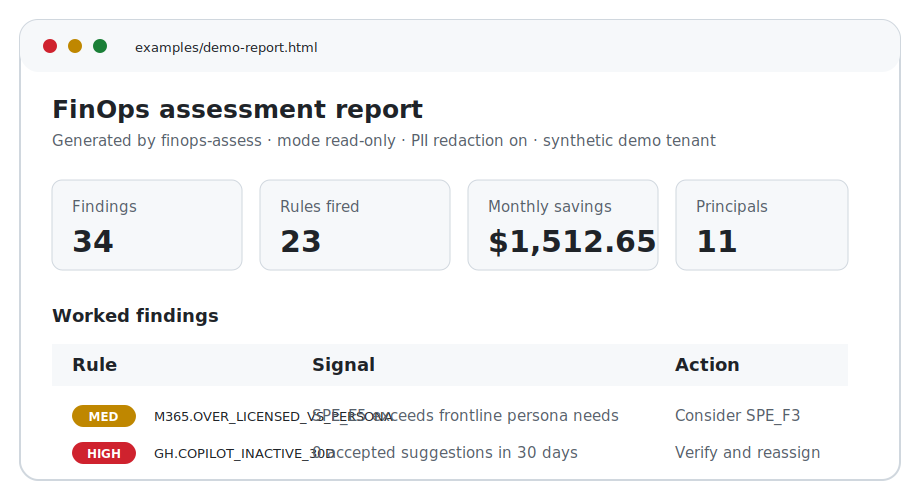
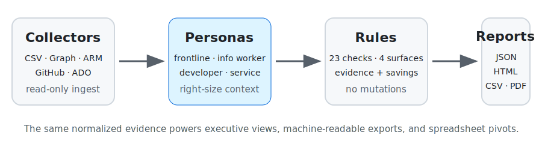

# What `finops-assess` gives you

`finops-assess` turns read-only Microsoft ecosystem inventory and usage data into
right-sizing findings with evidence. It is not just a how-to-use CLI: the output is
a review pack for license owners, FinOps analysts, and platform admins.

> Rule IDs and demo numbers on this page are quoted from the committed
> deterministic demo reports in [`examples/`](../examples/). If the demo data or
> rules change, update this guide alongside the regenerated examples.

## At a glance

A completed run gives you:

- an **executive HTML report** grouped by surface, severity, persona, current SKU,
  recommended SKU, savings, and evidence;
- a **canonical JSON report** for automation and long-term evidence storage;
- a **flat CSV export** for Excel, Sheets, Power BI, or chargeback workflows;
- an optional **PDF** rendered from the same report for sign-off packs.



## The deterministic demo, end-to-end

The bundled demo uses a synthetic tenant and writes the same report shapes a real
CSV or live-collector run writes:

```console
$ finops-assess demo --output-dir ./demo-report
OK — demo run produced 34 findings across 23 rules.
  JSON: demo-report/demo-report.json
  HTML: demo-report/demo-report.html
  CSV:  demo-report/demo-report.csv
```

Committed examples are available without installing the package:

- [`examples/demo-report.html`](../examples/demo-report.html) — self-contained,
  print-friendly report preview.
- [`examples/demo-report.json`](../examples/demo-report.json) — full structured
  report with summary, findings, and evidence.
- [`examples/demo-report.csv`](../examples/demo-report.csv) — one row per finding
  for pivots and exports.

The sample input files under [`samples/`](../samples/) are synthetic illustrative
inputs using reserved `*.example` addresses. The committed report examples keep
PII redaction on, so principals appear as salted `sha256:...` identifiers.
`--no-pii-redaction` is an explicit operator opt-in.

## CLI visual



The normal flow is intentionally small: validate the local catalogue and rules,
then run either the synthetic demo, normalized CSVs, or live read-only collectors.

```console
$ finops-assess validate
OK — catalog: 87 SKUs, personas: 6, rules: 23

$ finops-assess demo --output-dir ./demo-report
OK — demo run produced 34 findings across 23 rules.
  JSON: demo-report/demo-report.json
  HTML: demo-report/demo-report.html
  CSV:  demo-report/demo-report.csv
```

## Report pipeline



The same normalized dataset powers every output format. Live collectors and CSV
inputs feed the persona engine, the rules engine emits evidence-backed findings,
and reporters shape those findings for different audiences.

## Worked examples: over-licensed and idle spend

`finops-assess` never mutates the systems it inspects. Treat every finding as a
read-only suggestion to verify before acting; compliance holds, eDiscovery
custodians, break-glass accounts, shared mailboxes, and service principals can
all be legitimate exceptions.

### Persona mismatch: E5 assigned to a frontline persona

Rule: `M365.OVER_LICENSED_VS_PERSONA`

The demo includes a principal classified as `frontline_worker` with `SPE_E5`.
The evidence says the persona only requires `intune.mam`, `mailbox.2gb`,
`office.web`, and `teams.basic`, while E5 supplies a much larger feature set.
The report recommends considering `SPE_F3`, with an estimated monthly savings of
`$49.00` for that assignment.

What this gives you: a conversation-ready exception list for license owners —
not just "unused," but "current SKU exceeds the persona's required features."

### Unused premium capabilities: E5 features not exercised

Rule: `M365.E5_FEATURES_UNUSED`

The demo flags E5 users with no Defender for Office 365 P2, Purview DLP/IP, or
Entra P2 risk-policy activity in the 90-day window. The recommended review path
is to consider stepping down to E3 plus targeted add-ons when business context
confirms the premium controls are not needed.

What this gives you: a targeted review queue for the most expensive bundles,
with evidence about which premium signals were checked.

### Duplicate bundle: standalone SKU already included

Rule: `M365.DUPLICATE_BUNDLE`

The demo finds an account with `SPE_E3` and the standalone
`SHAREPOINTENTERPRISE` assignment, even though E3 already includes that
capability. The CSV export estimates `$10.00` monthly savings for the duplicate
assignment.

What this gives you: deterministic cleanup candidates for bundle overlap that
are easy to pivot by SKU, department, or tenant segment.

### Inactive developer-surface seats

Rules: `GH.COPILOT_INACTIVE_30D`, `ADO.STAKEHOLDER_ELIGIBLE`

The demo also covers non-M365 spend. It flags a GitHub Copilot Business seat
with zero accepted suggestions in 30 days (`$19.00` monthly savings in the CSV)
and an Azure DevOps Basic user whose only recent activity is reading boards and
commenting (`$6.00` monthly savings in the CSV).

What this gives you: one cross-surface view of Microsoft ecosystem SaaS spend,
not separate spreadsheets for M365, GitHub, and Azure DevOps.

### Azure idle and oversized resources

Rules: `AZ.IDLE_VM_14D`, `AZ.OVERSIZED_VM`, `AZ.UNATTACHED_DISK`,
`AZ.PUBLIC_IP_UNATTACHED`, `AZ.RESERVATION_UNDERUTILIZED`,
`AZ.LOG_ANALYTICS_OVERINGEST`, `AZ.DEV_TEST_SUB_MISMATCH`

The Azure rules turn resource metrics and cost signals into the same finding
shape as license issues. The demo includes idle compute, unattached resources,
reservation underutilization, Log Analytics over-ingest, and Dev/Test mismatch
examples.

What this gives you: infrastructure and seat recommendations in one report,
with consistent severity, confidence, savings, and evidence fields.

## Under-licensed cases: current boundary

The current v0.1 ruleset is cost-right-sizing focused. It detects
**over-licensed**, duplicate, idle, inactive, and over-provisioned cases; it does
not yet ship a `*.UNDER_LICENSED_*` rule family that asserts a user or workload
lacks required capabilities.

Today, use the persona evidence to review potential under-coverage manually:

- compare each assigned persona's required features against the current SKU
  evidence in `M365.OVER_LICENSED_VS_PERSONA` findings;
- inspect low-confidence persona assignments in JSON when job title, group, and
  usage signals disagree;
- treat missing activity signals as review prompts, not automatic removal
  instructions.

If under-licensed detection is added later, it should be tracked as a separate
schema/rule change with tests and conservative wording.

## Developed capabilities shipped today

The current rule reference lists **23 implemented rules** across four surfaces:

- **Microsoft 365** — unused licenses, persona over-licensing, duplicate bundles,
  disabled users with licenses, shared mailbox licensing, guest premium seats,
  inactive Copilot for M365, and E5 premium-feature inactivity.
- **Azure** — idle VMs, unattached disks, unattached public IPs, oversized VMs,
  underutilized reservations, Log Analytics over-ingest, and Dev/Test pricing
  mismatch.
- **GitHub** — inactive enterprise seats, inactive Copilot seats, over-provisioned
  GHAS, and runner tier mismatch.
- **Azure DevOps** — inactive Basic seats, Stakeholder-eligible users,
  over-provisioned parallel jobs, and unused Test Plans seats.

Cross-cutting capabilities include the persona engine, deterministic demo data,
JSON/HTML/CSV/PDF reporters, read-only live collectors, and PII redaction on by
default.

For the authoritative current list, use [`docs/rules.md`](rules.md).

## What it will not do

- It does **not** remediate, remove, downgrade, or mutate anything.
- It does **not** request write scopes or document write-scope credentials.
- It does **not** audit non-Microsoft SaaS, on-prem CALs, or perpetual licensing.
- It does **not** redistribute third-party diagrams or proprietary pricing tables.

## Pointers

- Data contract: [`docs/schema.md`](schema.md)
- Rule reference: [`docs/rules.md`](rules.md)
- Example HTML report: [`examples/demo-report.html`](../examples/demo-report.html)
- Contributor docs: [`docs/contributing.md`](contributing.md)
